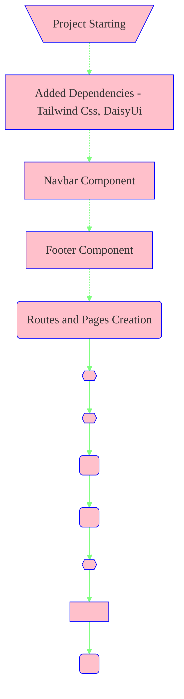

# Github-Finder Project

## Made this React Project Using Vite + Tailwind + DaisyUI:

### Available Scripts

#### `npm run dev`

-  Runs the app in the development mode.

#### `npm run build`

-  Builds the app for Production

## Flow Of Creation of GithubFinder App:

