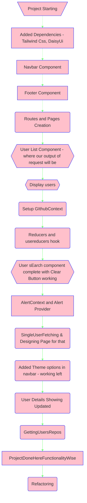

# Github-Finder Project: 

<p align="center">
	
</p>
<p align="center">
	<em><code>❯ REPLACE-ME</code></em>
</p>
<p align="center">
	<!-- Shields.io badges disabled, using skill icons. --></p>
<p align="center">Built with the tools and technologies:</p>
<p align="center">
	<a href="https://skillicons.dev">
		
	</a></p>
<br>

##  Table of Contents

- [ Overview](#-overview)
- [ Features](#-features)
- [ Project Structure](#-project-structure)
  - [ Project Index](#-project-index)
- [ Getting Started](#-getting-started)
  - [ Prerequisites](#-prerequisites)
  - [ Installation](#-installation)
  - [ Usage](#-usage)
  - [ Testing](#-testing)
- [ Project Roadmap](#-project-roadmap)
- [ Contributing](#-contributing)
- [ License](#-license)
- [ Acknowledgments](#-acknowledgments)

---

##  Overview

<code>❯ REPLACE-ME</code>

---

##  Features

<code>❯ REPLACE-ME</code>

---

##  Project Structure

```sh
└── Github-Finder_using_Vite.js/
    ├── README.md
    ├── eslint.config.js
    ├── index.html
    ├── package-lock.json
    ├── package.json
    ├── postcss.config.js
    ├── src
    │   ├── App.jsx
    │   ├── components
    │   ├── context
    │   ├── index.css
    │   ├── main.jsx
    │   └── pages
    ├── tailwind.config.js
    └── vite.config.js
```


###  Project Index
<details open>
	<summary><b><code>GITHUB-FINDER_USING_VITE.JS/</code></b></summary>
	<details> <!-- __root__ Submodule -->
		<summary><b>__root__</b></summary>
		<blockquote>
			<table>
			<tr>
				<td><b><a href='https://github.com/imnakul/Github-Finder_using_Vite.js/blob/master/postcss.config.js'>postcss.config.js</a></b></td>
				<td><code>❯ REPLACE-ME</code></td>
			</tr>
			<tr>
				<td><b><a href='https://github.com/imnakul/Github-Finder_using_Vite.js/blob/master/package-lock.json'>package-lock.json</a></b></td>
				<td><code>❯ REPLACE-ME</code></td>
			</tr>
			<tr>
				<td><b><a href='https://github.com/imnakul/Github-Finder_using_Vite.js/blob/master/tailwind.config.js'>tailwind.config.js</a></b></td>
				<td><code>❯ REPLACE-ME</code></td>
			</tr>
			<tr>
				<td><b><a href='https://github.com/imnakul/Github-Finder_using_Vite.js/blob/master/vite.config.js'>vite.config.js</a></b></td>
				<td><code>❯ REPLACE-ME</code></td>
			</tr>
			<tr>
				<td><b><a href='https://github.com/imnakul/Github-Finder_using_Vite.js/blob/master/package.json'>package.json</a></b></td>
				<td><code>❯ REPLACE-ME</code></td>
			</tr>
			<tr>
				<td><b><a href='https://github.com/imnakul/Github-Finder_using_Vite.js/blob/master/index.html'>index.html</a></b></td>
				<td><code>❯ REPLACE-ME</code></td>
			</tr>
			<tr>
				<td><b><a href='https://github.com/imnakul/Github-Finder_using_Vite.js/blob/master/eslint.config.js'>eslint.config.js</a></b></td>
				<td><code>❯ REPLACE-ME</code></td>
			</tr>
			</table>
		</blockquote>
	</details>
	<details> <!-- src Submodule -->
		<summary><b>src</b></summary>
		<blockquote>
			<table>
			<tr>
				<td><b><a href='https://github.com/imnakul/Github-Finder_using_Vite.js/blob/master/src/index.css'>index.css</a></b></td>
				<td><code>❯ REPLACE-ME</code></td>
			</tr>
			<tr>
				<td><b><a href='https://github.com/imnakul/Github-Finder_using_Vite.js/blob/master/src/App.jsx'>App.jsx</a></b></td>
				<td><code>❯ REPLACE-ME</code></td>
			</tr>
			<tr>
				<td><b><a href='https://github.com/imnakul/Github-Finder_using_Vite.js/blob/master/src/main.jsx'>main.jsx</a></b></td>
				<td><code>❯ REPLACE-ME</code></td>
			</tr>
			</table>
			<details>
				<summary><b>components</b></summary>
				<blockquote>
					<details>
						<summary><b>users</b></summary>
						<blockquote>
							<table>
							<tr>
								<td><b><a href='https://github.com/imnakul/Github-Finder_using_Vite.js/blob/master/src/components/users/UserSearch.jsx'>UserSearch.jsx</a></b></td>
								<td><code>❯ REPLACE-ME</code></td>
							</tr>
							<tr>
								<td><b><a href='https://github.com/imnakul/Github-Finder_using_Vite.js/blob/master/src/components/users/UserResults.jsx'>UserResults.jsx</a></b></td>
								<td><code>❯ REPLACE-ME</code></td>
							</tr>
							<tr>
								<td><b><a href='https://github.com/imnakul/Github-Finder_using_Vite.js/blob/master/src/components/users/UserItem.jsx'>UserItem.jsx</a></b></td>
								<td><code>❯ REPLACE-ME</code></td>
							</tr>
							</table>
						</blockquote>
					</details>
					<details>
						<summary><b>layout</b></summary>
						<blockquote>
							<table>
							<tr>
								<td><b><a href='https://github.com/imnakul/Github-Finder_using_Vite.js/blob/master/src/components/layout/Navbar.jsx'>Navbar.jsx</a></b></td>
								<td><code>❯ REPLACE-ME</code></td>
							</tr>
							<tr>
								<td><b><a href='https://github.com/imnakul/Github-Finder_using_Vite.js/blob/master/src/components/layout/Footer.jsx'>Footer.jsx</a></b></td>
								<td><code>❯ REPLACE-ME</code></td>
							</tr>
							<tr>
								<td><b><a href='https://github.com/imnakul/Github-Finder_using_Vite.js/blob/master/src/components/layout/Alert.jsx'>Alert.jsx</a></b></td>
								<td><code>❯ REPLACE-ME</code></td>
							</tr>
							<tr>
								<td><b><a href='https://github.com/imnakul/Github-Finder_using_Vite.js/blob/master/src/components/layout/Spinner.jsx'>Spinner.jsx</a></b></td>
								<td><code>❯ REPLACE-ME</code></td>
							</tr>
							</table>
						</blockquote>
					</details>
					<details>
						<summary><b>repos</b></summary>
						<blockquote>
							<table>
							<tr>
								<td><b><a href='https://github.com/imnakul/Github-Finder_using_Vite.js/blob/master/src/components/repos/RepoItem.jsx'>RepoItem.jsx</a></b></td>
								<td><code>❯ REPLACE-ME</code></td>
							</tr>
							<tr>
								<td><b><a href='https://github.com/imnakul/Github-Finder_using_Vite.js/blob/master/src/components/repos/RepoList.jsx'>RepoList.jsx</a></b></td>
								<td><code>❯ REPLACE-ME</code></td>
							</tr>
							</table>
						</blockquote>
					</details>
				</blockquote>
			</details>
			<details>
				<summary><b>pages</b></summary>
				<blockquote>
					<table>
					<tr>
						<td><b><a href='https://github.com/imnakul/Github-Finder_using_Vite.js/blob/master/src/pages/NotFound.jsx'>NotFound.jsx</a></b></td>
						<td><code>❯ REPLACE-ME</code></td>
					</tr>
					<tr>
						<td><b><a href='https://github.com/imnakul/Github-Finder_using_Vite.js/blob/master/src/pages/User.jsx'>User.jsx</a></b></td>
						<td><code>❯ REPLACE-ME</code></td>
					</tr>
					<tr>
						<td><b><a href='https://github.com/imnakul/Github-Finder_using_Vite.js/blob/master/src/pages/About.jsx'>About.jsx</a></b></td>
						<td><code>❯ REPLACE-ME</code></td>
					</tr>
					<tr>
						<td><b><a href='https://github.com/imnakul/Github-Finder_using_Vite.js/blob/master/src/pages/Home.jsx'>Home.jsx</a></b></td>
						<td><code>❯ REPLACE-ME</code></td>
					</tr>
					</table>
				</blockquote>
			</details>
			<details>
				<summary><b>context</b></summary>
				<blockquote>
					<details>
						<summary><b>alert</b></summary>
						<blockquote>
							<table>
							<tr>
								<td><b><a href='https://github.com/imnakul/Github-Finder_using_Vite.js/blob/master/src/context/alert/AlertReducer.js'>AlertReducer.js</a></b></td>
								<td><code>❯ REPLACE-ME</code></td>
							</tr>
							<tr>
								<td><b><a href='https://github.com/imnakul/Github-Finder_using_Vite.js/blob/master/src/context/alert/AlertContext.jsx'>AlertContext.jsx</a></b></td>
								<td><code>❯ REPLACE-ME</code></td>
							</tr>
							</table>
						</blockquote>
					</details>
					<details>
						<summary><b>github</b></summary>
						<blockquote>
							<table>
							<tr>
								<td><b><a href='https://github.com/imnakul/Github-Finder_using_Vite.js/blob/master/src/context/github/GithubContext.jsx'>GithubContext.jsx</a></b></td>
								<td><code>❯ REPLACE-ME</code></td>
							</tr>
							<tr>
								<td><b><a href='https://github.com/imnakul/Github-Finder_using_Vite.js/blob/master/src/context/github/GithubReducer.js'>GithubReducer.js</a></b></td>
								<td><code>❯ REPLACE-ME</code></td>
							</tr>
							<tr>
								<td><b><a href='https://github.com/imnakul/Github-Finder_using_Vite.js/blob/master/src/context/github/GithubActions.js'>GithubActions.js</a></b></td>
								<td><code>❯ REPLACE-ME</code></td>
							</tr>
							</table>
						</blockquote>
					</details>
				</blockquote>
			</details>
		</blockquote>
	</details>
</details>

---
##  Getting Started

###  Prerequisites

Before getting started with Github-Finder_using_Vite.js, ensure your runtime environment meets the following requirements:

- **Programming Language:** JavaScript
- **Package Manager:** Npm

###  Usage
Run Github-Finder_using_Vite.js using the following command:
**Using `npm`** &nbsp; [](https://www.npmjs.com/)

```sh
❯ npm start
```


###  Testing
Run the test suite using the following command:
**Using `npm`** &nbsp; [](https://www.npmjs.com/)

```sh
❯ npm test
```


---
##  Project Roadmap

- [X] **`Task 1`**: <strike>Implement feature one.</strike>
- [ ] **`Task 2`**: Implement feature two.
- [ ] **`Task 3`**: Implement feature three.

---

<details closed>
<summary>Contributor Graph</summary>
<br>
<p align="left">
   <a href="https://github.com{/imnakul/Github-Finder_using_Vite.js/}graphs/contributors">
      
   </a>
</p>
</details>

---

##  Acknowledgments

- List any resources, contributors, inspiration, etc. here.

---

  

https://github.com/user-attachments/assets/36855ce4-da64-4fee-9260-0201552558a0

## Flow Of Creation of GithubFinder App:


```mermaid
%%{init: {'theme': 'base', 'themeVariables': { 'fontSize': '18px', 'fontFamily': 'Algerian' , 'primaryBorderColor': 'blue' , 'background' : 'purple', 'mainBkg': 'pink'}}}%%
flowchart TD
   1[\Project Starting/]
   -.-> 2[Added Dependencies - Tailwind Css, DaisyUi ]
   -.-> 3[Navbar Component]
   -.-> 4[Footer Component]
   -.-> 5
    5(Routes and Pages Creation) --> B
    B{{User List Component - where our output of request will be }}
    B --> C{{Display users }}
     --> D( Setup GIthubContext)
     --> E(Reducers and usereducers hook )
     --> F{{User sEarch component complete with Clear Button working }}
     --> G[AlertContext and Alert Provider ]
     --> M(SingleUserFetching & Designing Page for that )
     --> N(Added Theme options in navbar - working left  )
     --> O(User Details Showing Updated )
     --> P(GettingUsersRepos )
     --> Q[ProjectDoneHereFunctionalityWise]
     --> R(Refactoring)

```
