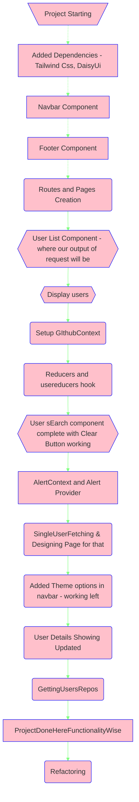

# Github-Finder Project: 

  

https://github.com/user-attachments/assets/36855ce4-da64-4fee-9260-0201552558a0

## Flow Of Creation of GithubFinder App:

```mermaid
%%{init: {'theme': 'base', 'themeVariables': { 'fontSize': '18px', 'fontFamily': 'Algerian' , 'primaryBorderColor': 'blue' , 'background' : 'purple', 'mainBkg': 'pink'}}}%%
flowchart TD
   1[\Project Starting/]
   -.-> 2[Added Dependencies - Tailwind Css, DaisyUi ]
   -.-> 3[Navbar Component]
   -.-> 4[Footer Component]
   -.-> 5
    5(Routes and Pages Creation) --> B
    B{{User List Component - where our output of request will be }}
    B --> C{{Display users }}
     --> D( Setup GIthubContext)
     --> E(Reducers and usereducers hook )
     --> F{{User sEarch component complete with Clear Button working }}
     --> G[AlertContext and Alert Provider ]
     --> M(SingleUserFetching & Designing Page for that )
     --> N(Added Theme options in navbar - working left  )
     --> O(User Details Showing Updated )
     --> P(GettingUsersRepos )
     --> Q[ProjectDoneHereFunctionalityWise]
     --> R(Refactoring)

```
